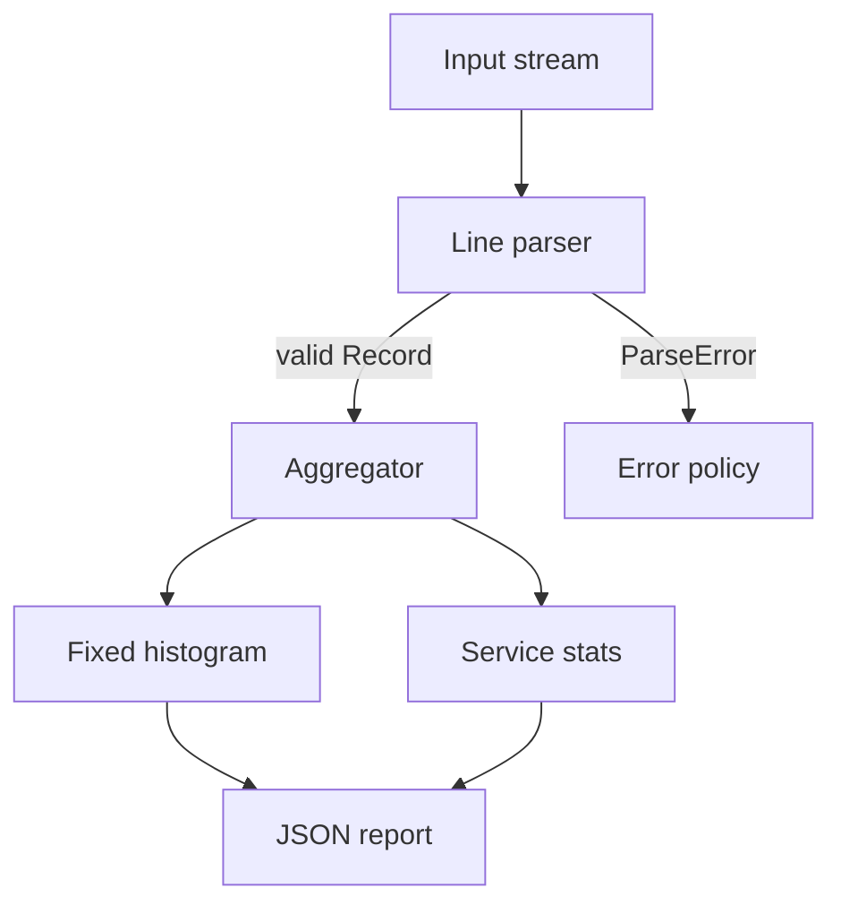

# LogLens 製品設計

## Product

LogLensはspace-separated access logをstreaming集計し、service別のcount、error rate、average latency、approximate p95をJSONで出すCLIです。

入力format:

```text
timestamp level service latency_ms status
2026-07-12T01:00:00Z INFO api 12 200
```

## Requirements

- 1行ずつ処理し、log全体をmemoryへ載せない。
- malformed lineをcountし、`--strict`なら即時失敗する。
- serviceごとにcount、latency sum/max、status class、p95を出す。
- stdoutはmachine-readable JSON、diagnosticはstderr。
- deterministic key order。
- non-zero exit codeを分類する。
- 1行bytesとunique service数を上限管理する。
- external runtime dependencyなし。

## Architecture



## Key design decisions

### Streaming

`std::getline`で1行ずつ読みます。recordはその場でparse・aggregateし、保持しません。

### Bounded-memory percentile

latencyはpower-of-two histogramへ格納します。exact percentileのために全latencyを保存せず、serviceごとに固定bucketだけ保持します。

- memory: `O(number of services × buckets)`
- update: `O(1)`
- p95: bucket upper boundの近似
- tradeoff: exact valueではない

### Parser

integerは`std::from_chars`でparseします。exception、locale、temporary allocationを避けます。service名は`[A-Za-z0-9_.-]+`に制限し、JSON injectionとambiguous tokenを避けます。

### Determinism

aggregationは`unordered_map`、report時にservice nameをsortします。hot pathの速度とstable outputを両立します。

## Exit codes

| Code | Meaning |
| --- | --- |
| 0 | success |
| 2 | invalid CLI arguments |
| 3 | input file error |
| 4 | malformed input under `--strict` |
| 5 | resource limit / allocation failure |

## Non-functional quality

- `-Wall -Wextra -Wpedantic -Wconversion -Wshadow`
- AddressSanitizer + UndefinedBehaviorSanitizer
- unit tests for parser/histogram/aggregation
- CLI integration tests、parser fuzz、deterministic benchmark
- release build with `-O3 -DNDEBUG`
- schema version、checksum、provenance、SPDX SBOM

## Carbon migration seam

最初に移す候補はhistogram bucket計算です。I/Oやstring parseより小さく、pureで、C++とのresult比較が容易です。製品全体を一度に移しません。
