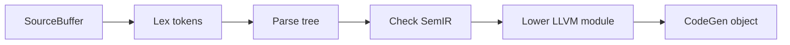

# Carbon toolchain設計

## Compiler pipeline

公式toolchain architectureは次の明確なphaseに分かれます。

Driverがcommandと全体flowを結び、Diagnosticsが各phaseのerrorを出します。`carbon compile`は最終的にobject fileを作り、`carbon link`がexecutableを作ります。

## 各phaseで見るもの

| Phase | Input | Output | 主なfailure |
| --- | --- | --- | --- |
| Source | file | `SourceBuffer` | I/O、encoding |
| Lex | source buffer | `Lex::TokenizedBuffer` | invalid token/literal |
| Parse | tokens | `Parse::Tree` | grammar、delimiter |
| Check | parse tree | `SemIR::File` | name/type/impl resolution |
| Lower | SemIR | LLVM Module | representation/codegen preparation |
| CodeGen | LLVM Module | object file | target/backend |
| Link | object files/libs | executable | missing symbol/runtime/library |

compile失敗を一括りにせず、どのphaseかを診断します。Carbon contributorになる場合、small featureがtokens、parse node、SemIR、lowering、diagnostic、file testsのどこへ影響するかを先にmapします。

## Design patterns

### Distinct steps

各phaseはcallbackで次phaseを直接駆動せず、明示的なoutput structureを作ります。input/output contractが明確で、localityと理解しやすさを狙います。

### Vectorized storage

tree nodeなどを個別heap object/pointer graphとして持つより、vectorに密に置きsmall indexで参照します。

期待する効果:

- allocation overhead低減
- cache locality改善
- compactなhandle
- serialization/debug representationの安定化

tradeoff:

- index validity/invariant管理が必要
- direct pointer APIよりaccessorが増える
- container relocationとidentityの設計が必要

### Iterative processing

parserはrecursive callよりexplicit state stackとloopを重視します。悪意ある/極端に深いsourceでもC++ call stack limitへ依存しにくくします。

## SemIRを学ぶ理由

SemIRはsyntax treeとLLVM IRの間にあるsemantic representationです。name resolution、type information、generic semanticsなど、LLVM IRに直接落とすには高水準すぎる意味を保持します。

学習順:

1. simple Carbon sourceをcompileする
2. token/parse tree dump optionを`carbon help`で確認する
3. SemIR dumpを確認する
4. LLVM IR/objectとの対応を見る
5. diagnosticがどのphaseから出るか追う

CLI optionはnightlyで変化するため、この教材では固定commandを推測しません。必ずpinned binaryの`carbon help`をsource of truthにします。

## Contribution mini-project

最初のcontribution候補はparser crash修正より、既存issueに紐づくdiagnosticまたはfile test改善が安全です。

1. existing issueを選ぶ
2. failing `.carbon` file testを追加する
3. expected diagnosticを固定する
4. smallest phaseだけを変更する
5. full testとformatを実行する
6. design changeならimplementation PRより先にproposal/processを確認する

公式参照: https://docs.carbon-lang.dev/toolchain/docs/
